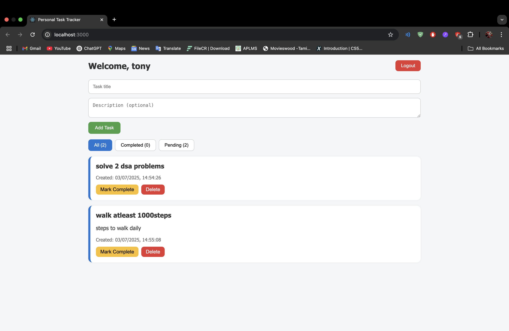

# 📝 Personal Task Tracker

## 📖 Description

A responsive and minimal personal task management app built using React.js. Users can log in with a username, manage their individual tasks, and keep track of completed and pending items. All data is stored in the browser using localStorage, unique to each user.

## 🚀 Features

- 🔐 Username-based login (no backend authentication)
- ➕ Add tasks with a title and optional description
- ✏️ Edit tasks inline
- ✅ Mark tasks as completed or pending
- 🗑 Delete tasks with confirmation
- 🔍 Filter tasks: All / Completed / Pending
- 📅 Each task shows creation date and time
- 💾 Tasks persist in `localStorage` per user
- 📱 Fully responsive for mobile and desktop
- ⚛️ Built with React functional components and hooks

---

## 🔗 Live Demo

👉 [View Deployed App on Vercel](https://personal-task-tracker-sage.vercel.app/)

---

## 🧰 Technologies Used

- React.js
- JavaScript (ES6+)
- CSS for styling
- LocalStorage API

---

## 🛠 Setup Instructions

### Step-by-step Setup:

1. Clone the repository  
   ```bash
   git clone https://github.com/Ramtej-velugoti/Personal-Task-Tracker.git
   cd Personal-Task-Tracker

2. Install the dependencies
    ```bash
    npm install

3. Start the development server
    ```bash
    npm start
    
4. Open the app in your browser at:
    ```bash
    http://localhost:3000

## 📸 Screenshots

#### 🏠 Simple Login Page


#### 📋 Dashboard (All Tasks)


#### 🆕 Adding Tasks


#### ⏳ Pending Tasks


#### ✅ Completed Tasks


📂 Folder Structure
Personal-Task-Tracker/
├── public/
│   └── index.html
├── screenshots/
│   ├── Adding Tasks.png
│   ├── Completed Tasks.png
│   ├── HomePage.png
│   ├── Pending Tasks.png
│   └── Simple Login page.png
├── src/
│   ├── components/
│   │   ├── Login.js
│   │   ├── TaskForm.js
│   │   ├── TaskItem.js
│   │   ├── TaskList.js
│   │   └── TaskFilter.js
│   ├── styles/
│   │   └── App.css
│   ├── utils/
│   │   └── localStorage.js
│   ├── App.js
│   └── index.js
├── package.json
└── README.md

🤝 Author
Built with 💻 and 💙 by Ramtej Velugoti

📜 License
This project is open-source and available under the MIT License.

---

Let me know if you want to optimize these images, create a dark/light toggle preview, or generate a GIF of the UI flow!